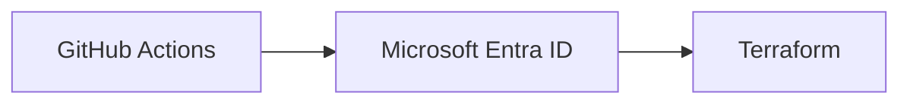

# Mermaid diagrams

Markdown fences and the existing `mermaid: true` page flag are unchanged. The
Eleventy plugin escapes the source into a `.mermaid` element; the base layout
loads the shortcode only on opted-in pages. Mermaid **10.9.5**, imported as an ES
module from unpkg, renders the SVGs in the browser, not during the build. No
packages or frameworks were added or upgraded.

## Where to maintain it

- `src/_includes/scripts/mermaid-theme.mjs`: central `base` configuration,
  flowchart/sequence options, SVG theme CSS and optional semantic palette.
- `src/scss/components/_mermaid.scss`: scroll container and colour custom
  properties derived from existing Sass tokens. Included by `main.scss` and
  compiled through the existing hashed CSS pipeline.
- `src/modules/eleventy-plugin-mermaid.js`: existing Markdown/loader integration.
  The theme module uses the existing scripts-to-assets passthrough copy.
- `tests/markdown.test.mjs`: Markdown integration regression coverage.

The loader resolves the diagram CSS colours and existing Inter font stack before
initializing Mermaid. Waiting for the site's font to load avoids measuring labels
with a fallback font. White nodes, thin borders, 9px rectangular corners, light
shadows, grey 1.5px connectors, 13px edge labels and pale green architecture
boundaries replace the neutral theme. Flowcharts use 45px node spacing, 65px rank
spacing, 18px padding and basis curves. Decision and storage shapes retain their
meaning; only rectangles receive rounded corners.

The site currently has no dark mode, so this feature follows its light surface.
If dark mode is added, update the diagram custom properties and semantic palette,
and re-render diagrams when the theme changes: Mermaid calculates colours at
initialization, so changing CSS variables alone is insufficient.

No CSP was found in repository headers, templates or deployment configuration.
The existing external module and inline initialization approach is retained;
a future CSP must allow the CDN module graph, initialization and Mermaid SVG
styles. Mermaid's default security level remains unchanged.

## Optional flowchart classes

Available classes: `github`, `entra`, `azure`, `terraform`, `security`, `storage`,
`external`. The alternative `class github github` syntax also works. No `classDef`
injection or source rewriting is necessary: theme CSS targets the classes Mermaid
10.9.5 puts on flowchart node groups. Use descriptive labels and meaningful shapes;
colour is supplementary. Existing explicit `classDef` and inline styles keep
precedence over the theme's default fills.

## Responsive behaviour and accessibility

SVGs retain their intrinsic viewBox width rather than shrinking a wide architecture
diagram to phone width. The diagram container scrolls horizontally, is keyboard
focusable and has a visible focus outline. Smaller diagrams are centred. Existing
`accTitle` and `accDescr` statements and generated SVG accessibility attributes are
preserved. The standard pa11y configuration hides Mermaid, so browser checks are
needed in addition to that runner.

## Limits and checking changes

Mermaid owns layout and routing. A very wide LR diagram can require substantial
scrolling; the theme doesn't rearrange authored nodes. Theme variables apply to
other diagram types, but flowchart-only CSS and semantic classes don't restyle
all of Mermaid's distinct renderers. Author-defined fills are deliberately
preserved. This CSS uses Mermaid 10.9.5 SVG selectors; recheck them on upgrades.

The base-theme configuration follows [Mermaid's theming documentation](https://mermaid.js.org/config/theming).

Run `npm run build`, `npm run lint:check`, `npm run format:scss:check`,
`npm run lint:scss`, `npm run test:content`, `npm run test:scss` and
`npm run test:output`. Then run `npm run serve` and inspect:

- `/identity-access-management/articles/github-actions-entra-oidc/`: large LR
  architecture with long labels, HTML line breaks, labelled and dashed edges.
- `/hcta/articles/ams-tools-architecture/`: simple flowchart, sequence, git graph,
  custom-colour flowchart, class, quadrant, mindmap, journey and pie diagrams.

Check at desktop and 390px mobile widths, scrolling the diagram with keyboard and
pointer. No article currently contains subgraphs, so a separate semantic-class
fixture was used to check boundaries, shapes and accessible title/description.

Verified in headless Chromium: all ten existing diagrams and the extra fixture
rendered successfully, semantic fills (including storage cylinders) matched the
palette, accessible SVG titles survived, and both article loaders rendered at
390px without document overflow. The build and all checks listed above passed.
Initialization must stay before the font wait: otherwise Mermaid's automatic
load handler can race the custom configuration and render with its default theme.
