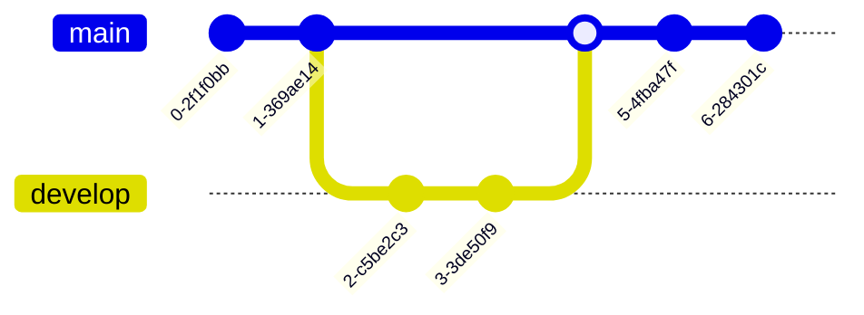

## Introduction

I come from a Agile Technical Architecture background. This means operating in a servant role for teams rather than top down.

In this role, your responsibilities are:

- Enabling people to make decisions
- Empathy and support for people when things go wrong
- Provide high level business and technology requirements to the technical teams
- Empower teams to own their work
- Share the understanding of where we are (AS IS)
- Provide the vision of where we are going (TO BE)
- Be the bridge between the business and technical teams

These responsibilities give you a split of two main skill areas:

1. Communication
2. Technical knowledge

You need to be able to wear different hats and adapt quickly to your situation.

### How you communicate

- Is your audience Product people?
  - Talk about the user value and financial cost of the decisions
- Is your audience Technical people?
  - Talk about the technical vision their decisions need to fit into

### Presenting Technical Knowledge

- Is the team well established and knowledgable?
  - Give them the parameters to work within and stand back so they can do their work.
- Is the team new or Junior heavy?
  - Spend more time pairing and planning to help guide the technical decisions and learning resources.

To get to the point where you can be effective, you have to understand the business, its people and both their capabilities.

You are there to unblock and help, not hinder how people want to work.

## Using AMS (ArchiMate, Mermaid and Structurizr)

In this article I want to go over a set of tooling and ways of working I use to:

- Provide the correct diagram to tell your story
- Maintain your knowledge of the business in one place
- Prevent outdated diagrams existing in your business
- Use Diagrams as Code wherever possible
- Identify where not to use diagrams
- Store your data models where it is appropriate

There are three different tools and techniques to gather information, keep it up to date and help you tell a story to the right people in the right way:

- **ArchiMate** for data that changes rarely centered around the business
- **Mermaid** for data that belongs in the teams and is owned by them
- **Structurizr** for data that is owned by the technical persons in teams

## ArchiMate modelling

> The ArchiMate® modelling language is an open and independent Enterprise Architecture standard that supports the description, analysis and visualisation of architecture within and across business domains. ArchiMate is one of the open standards hosted by The Open Group® and is fully aligned with TOGAF®. ArchiMate aids stakeholders in assessing the impact of design choices and changes.

Citation: [ArchiMate Tool](https://www.ArchiMatetool.com/)

That is correct, the first tool I want to talk about comes from the TOGAF landscape which lends itself to more Enterprise Architecture modelling rather than Agile Architecture.

Just because a way of working does not fit how we want to work, it doesn't mean there isn't something we cannot learn from it.

With the constant change in Agile ways of working, we sometimes miss a way to centralise all the key business requirements in one place.

I have been a victim of having key business information written down somewhere deep in Google Drive from 3 years ago.

This is where ArchiMate excels. You can use the ArchiMate modelling language to store:

- Any knowledge that sits outside of the codebase
- Data that will not change on a regular basis
- Data that you will need to present to the business in various views

Within Archi we can easily generate an AS IS model of our Enterprise to understand the complexities of the business and have a place we can revisit on a regular basis to ensure we are meeting the requirements.

- **Business**
  - Business Value
  - Processes
  - Services
  - Actors
  - Contracts
  - Products
  - User Needs
  - Company/Department/Team structure
  - Roles
  - Stakeholders
- **Legislation**
  - Legal
  - Policies
- **Organisation Strategies**
  - Resources
  - Capabilities
  - Value Streams
- **Motivations**
  - Goals
  - Outcomes
  - Drivers
  - Values

If we know the above, we can make better decisions and help others find their way forward when building new products and features.

Below are a few examples on how we can structure our Data Model and the Views we can produce to tell a story.

TODO: Add example images

## Mermaid

> Mermaid is a JavaScript-based diagramming and charting tool that uses Markdown-inspired text definitions and a renderer to create and modify complex diagrams. The main purpose of Mermaid is to help documentation catch up with development.

Citation: [Mermaid Github repository](https://github.com/mermaid-js/mermaid#about)

When you have a need to record decisions that have been collaboratively decided with your teams, you want to use Mermaid.

Mermaid allows you to create Diagrams as Code. It has an easy to learn language with a wealth of online tooling to help you build your diagram.

Some of the advantages to using Mermaid are:

- You can add your diagrams to Source Control
- Works natively with Markdown
- Maintenance and creation is everyones responsibility
- Store in a central repository for organisation level diagrams
- Store your product and code base diagrams alongside your code
- Have full version history of changes over time
- Renders in Github natively and easily in a browser for documentation such as ADRs
- No storing and rendering images
- No additional tooling required in your pipelines to render diagrams
- Open Source your decisions
- A picture speaks a 1000 words

Below are examples of some diagrams you can create with Mermaid. Adding these to your ADRs and documentation will help those wanting to understand decisions in your organisation better.

All the below are written with Mermaid in Markdown and rendered on the fly using Mermaids Javascript library. See the source code of this page or the links below each one for further information.

### gitGraph

Source code: [Git Graph](https://raw.githubusercontent.com/johnnolan/mermaid-learning/main/gitGraph.md)

### Sequence Diagrams

Source code: [Sequence Diagram](https://raw.githubusercontent.com/johnnolan/mermaid-learning/main/2-sequenceDiagram-3.md)

### User Stories

Reference: [https://devrants.blog/2022/08/20/mermaid-event-storming/](https://devrants.blog/2022/08/20/mermaid-event-storming/)

### Class Diagram

Source code: [Class Diagram](https://raw.githubusercontent.com/johnnolan/mermaid-learning/main/1-classDiagram-2.md)

### Flow Diagram

Source code: [Flow Chart](https://mermaid.js.org/syntax/flowchart.html)

### Quadrant Chart

Source code: [Flow Chart](https://mermaid.js.org/syntax/flowchart.html)

### Pie Chart

Source code: [Pie Chart](https://mermaid.js.org/syntax/pie.html)

### User Journey

Source code: [User Journey](https://mermaid.js.org/syntax/userJourney.html)

### Mind Map

Source code: [Mind Map](https://mermaid.js.org/syntax/mindmap.html)

## Structurizr

