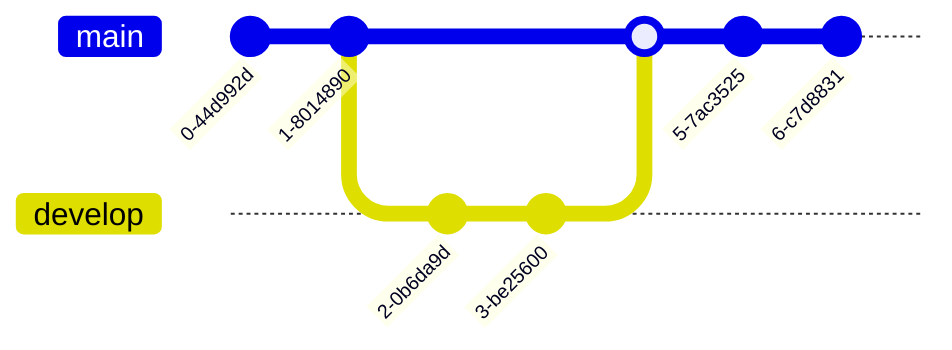
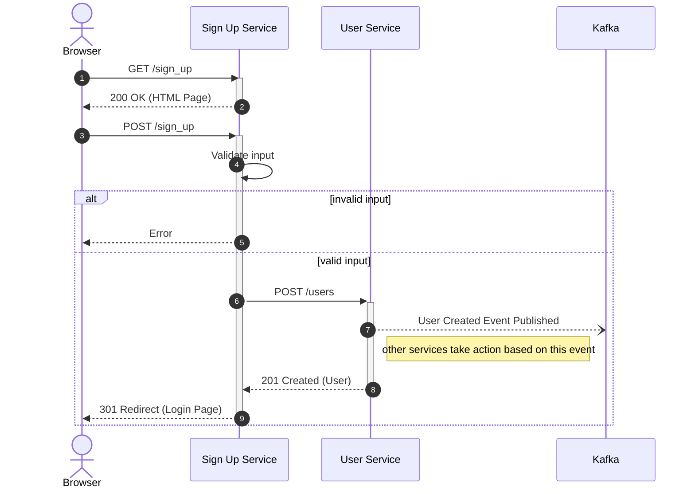
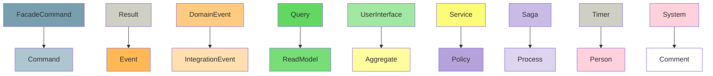
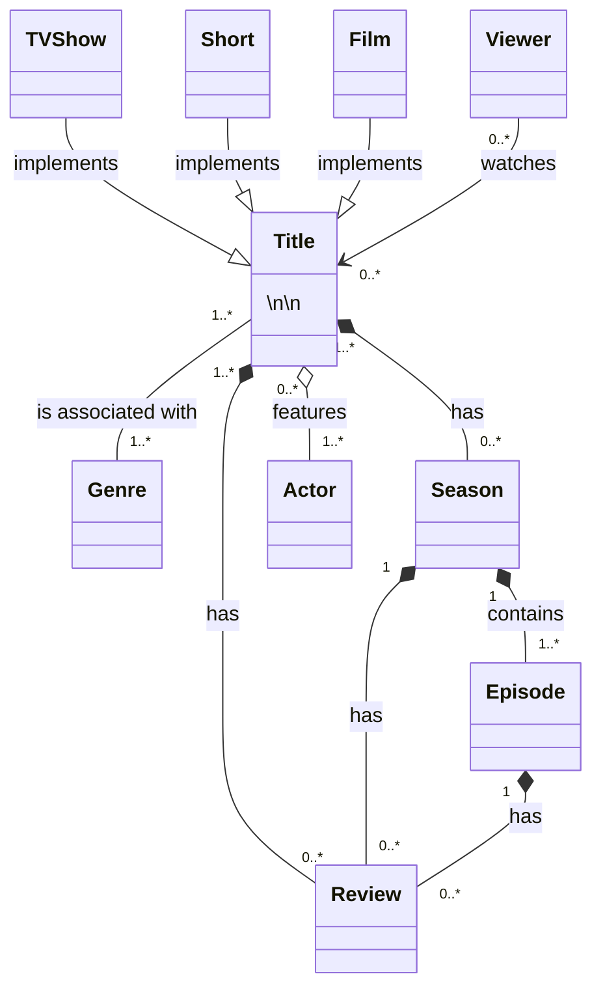
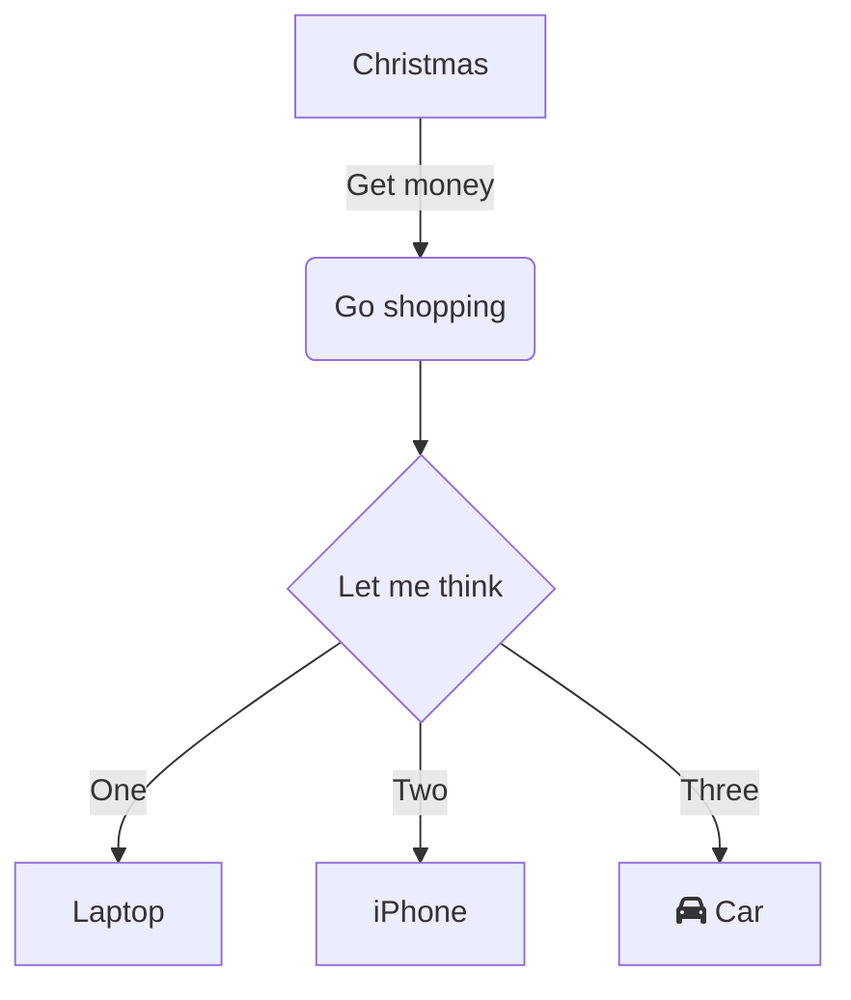
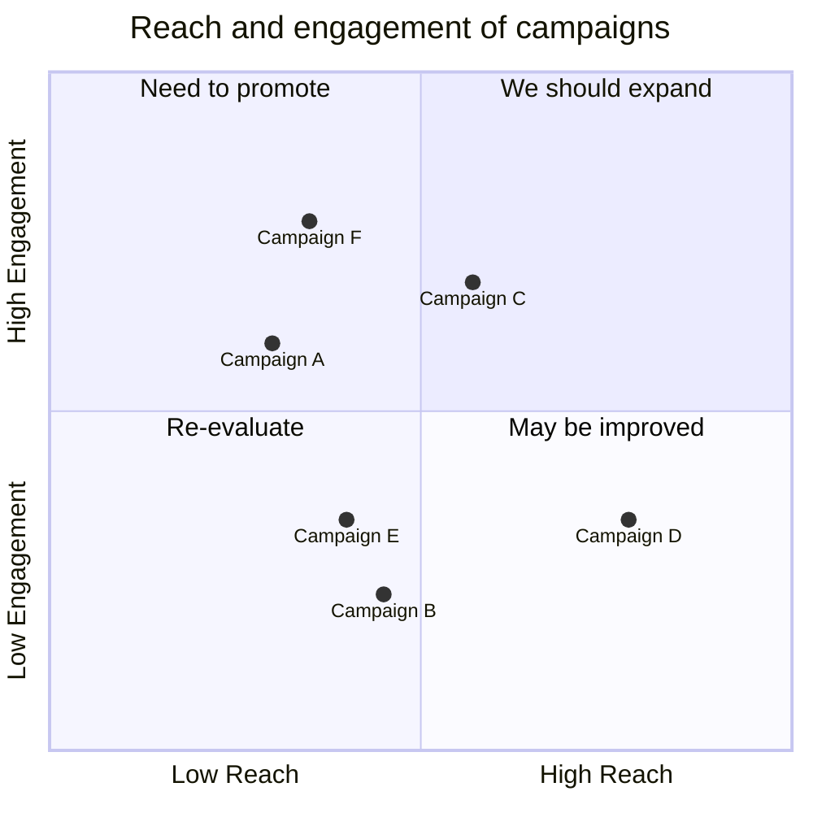
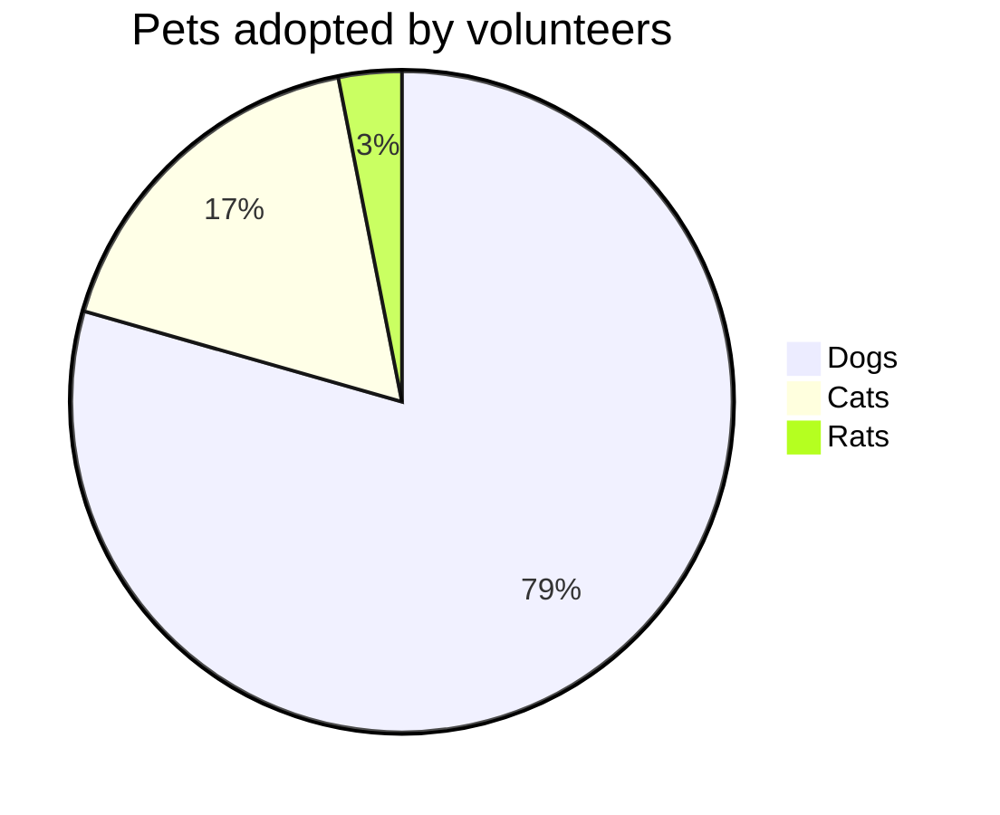
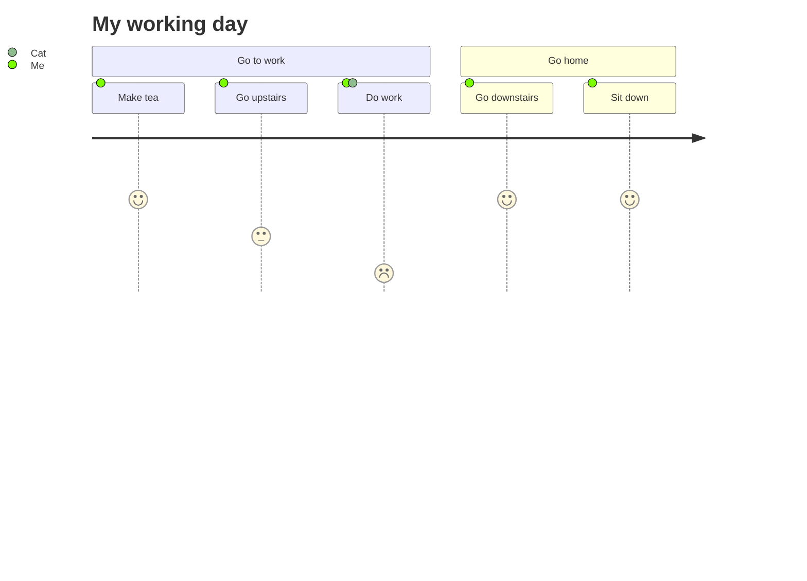
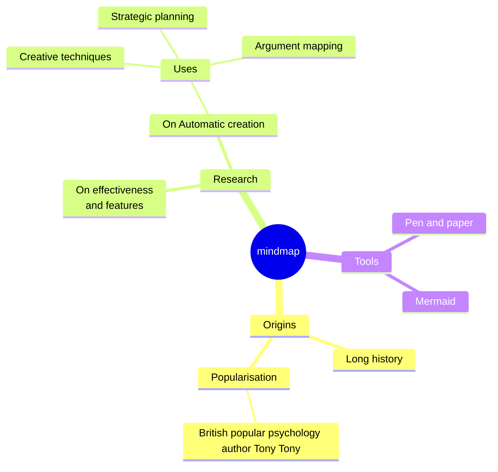

## Introduction

I come from a Agile Technical Architecture background. This means operating in a servant role for teams rather than top down.

In this role, some of your responsibilities are:

- Enabling people to make decisions
- Empathy and support for people when things go wrong
- Provide high level business and technology requirements to the technical teams
- Empower teams to own their work
- Share the understanding of where we are (ASIS)
- Provide the vision of where we are going (TOBE)
- Be the bridge between the business and technical teams

Two common responsibility areas are:

1. Communication/Collaboration
2. Technical/Domain knowledge

You need to be able to wear different hats and adapt quickly to your situation. It is common to explain the same situation in numerous contexts.

Explaining a plan to a board of directors, product person and developer all entail alterating your language and context.

To get to the point where you can be effective in these conversations, you have to understand the business, its people and both their capabilities.

## Using AMS (ArchiMate, Mermaid and Structurizr)

I want to go over a set of tooling, techniques and ways of working I use to:

- Maintain your knowledge of the business in one place
- Provide the correct diagram to tell your story
- Prevent outdated diagrams existing in your business
- Use Diagrams as Code wherever possible
- Identify where not to use diagrams
- Store your data models where it is appropriate

There are three different tools and techniques to gather information, keep it up to date and help you tell a story to the right people in the right way:

- **Archi - ArchiMate modelling language** for data that changes rarely, centered around the business
- **Mermaid** for data that belongs in the teams and is owned by them
- **Structurizr - C4 Model** for data that is owned by the technical persons in teams

## ArchiMate modelling language

> The ArchiMate® modelling language is an open and independent Enterprise Architecture standard that supports the description, analysis and visualisation of architecture within and across business domains. ArchiMate is one of the open standards hosted by The Open Group® and is fully aligned with TOGAF®. ArchiMate aids stakeholders in assessing the impact of design choices and changes.

Citation: [ArchiMate Tool](https://www.ArchiMatetool.com/)

ArchiMate comes from the TOGAF landscape which lends itself to more Enterprise Architecture modelling rather than Agile Architecture.

With the iterative development mindset in Agile ways of working, we sometimes miss a way to centralise all the key business requirements in one place, while keeping a high level view of the overall goal of our solutions.

This is where ArchiMate excels. You can use the ArchiMate modelling language to store:

- Any knowledge that sits outside of the codebase
- Data that will not change on a regular basis
- Data that you will need to present to the business in various views

Within Archi we can easily generate an ASIS model of our Enterprise to understand the complexities of the business and have a place we can revisit on a regular basis to ensure we are meeting the requirements.

### Business

- Business Value
- Processes
- Services
- Actors
- Contracts
- Products
- User Needs
- Company/Department/Team structure
- Roles
- Stakeholders

### Legislation

- Legal
- Policies

### Organisation Strategies

- Resources
- Capabilities
- Value Streams

### Motivations

- Goals
- Outcomes
- Drivers
- Values

If we know the above, we can make better decisions and help others find their way forward when building new products and features.

Archi allows us to add our data and create relationships across domain boundaries allowing us to visualise the complexities of an Organisation. Examples of some of these relationships are:

- Connect teams to Budgets
- Projects to Programming Languages and team member specialities
- External Services to internal dependencies
- Business Capabilities to team resources

### Example Data Models and Views in Archi

Below is a small set of examples of data you can store and visualise in Archi.

#### Strategy and Business needs

Define resources, capabilities and value streams, datasources, governance and any other context specific organisation strategies.

[](/assets/posts/ams-three/archi-strategy.png)
[](/assets/posts/ams-three/archi-strategy2.png)
[](/assets/posts/ams-three/archi-view-business-need.png)

#### Team Capability Recording

Record the Organisations teams by Professions, Actors, Teams and methodologies to identify resources across the landscape.

[](/assets/posts/ams-three/archi-teams.png)
[](/assets/posts/ams-three/archi-tech.png)
[](/assets/posts/ams-three/archi-view-teams.png)
[](/assets/posts/ams-three/archi-view-team-dependencies.png)

## Mermaid

> Mermaid is a JavaScript-based diagramming and charting tool that uses Markdown-inspired text definitions and a renderer to create and modify complex diagrams. The main purpose of Mermaid is to help documentation catch up with development.

Citation: [Mermaid Github repository](https://github.com/mermaid-js/mermaid#about)

When you have a need to record visualisation decisions that have been collaboratively decided with your teams, you want to use Mermaid.

Mermaid allows you to create Diagrams as Code. It is a flexible language with a wealth of online tooling to help you build your diagram.

Some of the advantages to using Mermaid are:

- You can add your diagrams to Source Control.
- Works natively with Markdown.
- Maintenance and creation is everyones responsibility.
- Store in a central repository for organisation level diagrams.
- Store your product and code base diagrams alongside your code.
- Have full version history of changes over time.
- Renders in Github natively in a browser for documentation such as ADRs.
- No storing and rendering images (you can if you want).
- No additional tooling required in your pipelines to render diagrams.
- Open Source your decisions.

Below are examples of some diagrams you can create with Mermaid. Adding these to your ADRs and documentation will help those wanting to understand decisions in your organisation better.

### Examples of Mermaid syntax

All the below are written with Mermaid in Markdown and rendered on the fly using Mermaids Javascript library. See the source code of this page or the links below each one for further information.

#### Git Graph



Source code: [Git Graph](https://raw.githubusercontent.com/johnnolan/mermaid-learning/main/gitGraph.md)

#### Sequence Diagrams



Source code: [Sequence Diagram](https://raw.githubusercontent.com/johnnolan/mermaid-learning/main/2-sequenceDiagram-3.md)

#### User Stories



Reference: [https://devrants.blog/2022/08/20/mermaid-event-storming/](https://devrants.blog/2022/08/20/mermaid-event-storming/)

#### Class Diagram



Source code: [Class Diagram](https://raw.githubusercontent.com/johnnolan/mermaid-learning/main/1-classDiagram-2.md)

#### Flow Diagram



Source code: [Flow Chart](https://mermaid.js.org/syntax/flowchart.html)

#### Quadrant Chart



Source code: [Flow Chart](https://mermaid.js.org/syntax/flowchart.html)

#### Pie Chart



Source code: [Pie Chart](https://mermaid.js.org/syntax/pie.html)

#### User Journey



Source code: [User Journey](https://mermaid.js.org/syntax/userJourney.html)

#### Mind Map



Source code: [Mind Map](https://mermaid.js.org/syntax/mindmap.html)

## Structurizr - C4 Model

> The C4 model was created as a way to help software development teams describe and communicate software architecture, both during up-front design sessions and when retrospectively documenting an existing codebase. It's a way to create maps of your code, at various levels of detail, in the same way you would use something like Google Maps to zoom in and out of an area you are interested in.

Citation: [C4 Model Website](https://c4model.com/)

If you are unfamiliar with Structurizr and C4 Modelling then I highly suggest watching the following video by Simon Brown. This 30 minute video will give you all the information you will need to get started.

[https://www.youtube.com/watch?v=x2-rSnhpw0g](https://www.youtube.com/watch?v=x2-rSnhpw0g)

### How C4 Modelling works

C4 Models are a great way to describe your software architecture alongside your code base. It allows you to break down your software architecture in four levels:

- Level 1: System Context
  - Shows how the software system fits into the world around it
- Level 2: Container
  - Shows the high-level technical building blocks
- Level 3: Component
  - Zooms in to the individual Containers showing the components inside
- Level 4: Code
  - Zoom into the individual components showing how that component is implemented

In my experience, I have never done Level 4 and rarely do Level 3 unless in an ideation stage. Changes in a code base, mean without automation, your diagrams at Level 3 and 4 can become quickly out of sync and provide little value compared to Level 1 and 2.

This does not mean it would not be valuable to have these for your teams. If this is the case I would recommend looking at specific language libraries that can generate Level 3 and 4 diagrams from your code or make updating the diagrams a part of your development lifecycle.

### What is Structurizr?

> Structurizr builds upon "diagrams as code", allowing you to create multiple software architecture diagrams from a single model. There are a number of tools for creating Structurizr compatible workspaces, with the Structurizr DSL being the recommended option for most teams.

Citation: [Structurizr Website](https://structurizr.com/)

[https://www.youtube.com/watch?v=4HEd1EEQLR0](https://www.youtube.com/watch?v=4HEd1EEQLR0)

Using Structurizr, we can create C4 Models as Code. It is specially designed to support C4 modelling, meaning it gives us a opinionated environment to work within.

An example of how we can write a simple Software System is:

``` dsl
workspace {

    model {
        user = person "User"
        softwareSystem = softwareSystem "Software System" {
            webapp = container "Web Application" {
                user -> this "Uses"
            }
            container "Database" {
                webapp -> this "Reads from and writes to"
            }
        }
    }

    views {
        systemContext softwareSystem {
            include *
            autolayout lr
        }

        container softwareSystem {
            include *
            autolayout lr
        }

        theme default
    }
}
```

This will provide us with the following output in SVG, PNG, PlantUML or Mermaid.

[](/assets/posts/ams-three/ams-three-c4-level1.png)
Credit: [https://structurizr.com/](https://structurizr.com/)

[](/assets/posts/ams-three/ams-three-c4-level2.png)
Credit: [https://structurizr.com/](https://structurizr.com/)

### Why use Structurizr C4 Modelling as well as Mermaid?

- Reference other diagrams and models [(use the !includes keyword)](https://github.com/structurizr/dsl/blob/master/docs/language-reference.md#includes):
  - e.g. store your Actors in a central repository
  - Reference other repositories diagrams
  - Create a high level Enterprise diagram that references all other repository diagrams
- Structured syntax specific to C4 Modelling.
- Open Source.
- Exports to a wide range of tools and visualisations such as:
  - PlantUML
  - C4-PlantUML
  - Mermaid
  - Ilograph
  - Graph view

## Conclusion

There are many tools and methodologies for Architecture and each project will require different solutions to understand and solve complex problems within organisations.

With the three tools above, we can:

- Keep business and user data that changes slowly in one place to understand and visualise using ArchiMate
- Record and version collaborative ASIS and TOBE ideas in multiple visualisations with Mermaid
- Maintain a high level view of our individual and enterprise level architecture, alongside the code with C4 Modelling and Structurizr

Mixing these three tools and methods we can provide the right information to the right people at the right level of detail while also maintaining a history of our decisions over time.

## References

- [Structurizr](https://structurizr.com/)
- [C4 Model Website](https://c4model.com/)
- [Developer Rants - Mermaid Event Storming](https://devrants.blog/2022/08/20/mermaid-event-storming/)
- [Mermaid Website](https://mermaid.js.org/)
- [Mermaid Live Editor!](https://mermaid.live/)
- [Mermaid Github Repo](https://github.com/mermaid-js/mermaid)
- [Scaled Agile Framework](https://scaledagileframework.com/about/)
- [Open Group ArchiMate Modelling Language](https://www.opengroup.org/archimate-forum/archimate-overview)
- [Archi Tool](https://www.archimatetool.com/)
- [Creating Software with Modern Diagramming Techniques by Ashley Peacock](https://pragprog.com/titles/apdiag/creating-software-with-modern-diagramming-techniques/)
