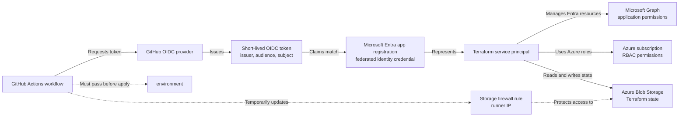

## Introduction

[Entra ID as Code repository](https://github.com/johnnolan/entra-id-as-code)

This post takes you through configuring Microsoft Entra ID and GitHub Actions for OIDC (OpenID Connect) through Federated Identity Credentials (Step 1 to Step 3).

Step 4 onwards continues to take you through fully setting up Terraform securely including Microsoft Graph permissions, Azure access, GitHub environment protection, and repository secrets using the [Entra ID as Code repository](https://github.com/johnnolan/entra-id-as-code) repository as an example.



## What this setup gives you

- Passwordless CI authentication from GitHub Actions to Entra ID.
- No long-lived client secret in GitHub.
- Scoped access for Terraform plan and apply workflows.

## Step 1: Get your GitHub repository IDs

1. Open the GitHub repository that will run Terraform.
2. Select **Settings** in the repository navigation.
3. In the **Security** section, then **Actions**.
4. Scroll to **OIDC** to open the repository's OIDC configuration page.
5. Record the **Organization ID** and **Repository ID** shown on the page. Ensure `Use immutable subject claim` is checked to see these values.

[](/assets/posts/iam/gha-oidc/oidc-config.png)

## Step 2: Create the app registration

> Example script and README to set this up can be found in the following links
>
> - Documentation: [GitHub Service Principle](https://github.com/johnnolan/entra-id-as-code/blob/main/scripts/create-github-service-principle.md)
> - PowerShell Script: [GitHub Service Principle PowerShell Script](https://github.com/johnnolan/entra-id-as-code/blob/main/scripts/create-github-service-principle.ps1)

1. Open the Entra admin centre.
2. Go to **Identity** > **Applications** > **App registrations**.
3. Select **New registration**.
4. Enter a name, for example `terraform-entra-id-as-code`.
5. Keep the default account type unless your tenant needs multi-tenant access.
6. Select **Register**.

Save these values from the app overview page:

- Application (client) ID.
- Directory (tenant) ID.

## Step 3: Create federated identity credentials

Add one credential for pull requests and one for main branch apply.

These credentials distinguish workflow contexts; credentials on the same application share its permissions.

1. Open your app registration.
2. Go to **Certificates & secrets** > **Federated credentials**.
3. Select **Add credential**.
4. Choose **GitHub Actions deploying Azure resources**.

[](/assets/posts/iam/gha-oidc/fed-creds-example-2.png)

### Credential A: pull request plan

Set these fields:

- Organization: `johnnolan`
- Repository: `entra-id-as-code`
- Entity type: **Pull request**
- Name: `github-pr-plan`

Expected subject identifier format:

- `repository_owner_id:ORGANIZATION_ID:repository_id:REPOSITORY_ID:context:pull_request`

### Credential B: production apply

Set these fields:

- Organization: `johnnolan`
- Organization ID: `github_organization_id`
- Repository: `entra-id-as-code`
- Repository ID: `github_repository_id`
- Entity type: **Environment**
- Environment name: `production`
- Name: `github-main-apply`

Expected subject identifier format:

- `repository_owner_id:ORGANIZATION_ID:repository_id:REPOSITORY_ID:context:environment:production`

See [GitHub OIDC subject guidance](https://docs.github.com/en/actions/reference/security/oidc#example-subject-claims).

### Verify issuer and audience

For both credentials, ensure these values are set:

- Issuer: `https://token.actions.githubusercontent.com`
- Audience: `api://AzureADTokenExchange`

> At this point, GitHub and Microsoft Entra ID are configured to trust each other for the workflow contexts you selected. If you only need to establish federated authentication, the setup is complete. Continue with the remaining steps to reproduce the full Terraform setup, including Microsoft Graph permissions, Azure access, GitHub environment protection, and repository secrets.

## Step 4: Grant Microsoft Graph application permissions

The AzureAD provider calls Microsoft Graph (Entra directory API). Grant only the roles your Terraform resources require.

1. Open app registration.
2. Go to **API permissions**.
3. Select **Add a permission** > **Microsoft Graph** > **Application permissions**.
4. Add the required Graph roles for your managed resources.
5. Select **Grant admin consent**.

Common required roles can include:

- `Policy.Read.All`
- `Policy.ReadWrite.ConditionalAccess`
- `EntitlementManagement.ReadWrite.All`

> For a list of roles needed, review each Terraform file in the [Terraform directory](https://github.com/johnnolan/entra-id-as-code/tree/main/terraform). Each file contains the permissions required to run.

## Step 5: Grant Azure RBAC for remote state

The Terraform backend uses Azure Blob Storage (state file stored in a storage account). Assign RBAC (role-based access control, authorisation by role assignment) so the app can read and write state.

> Example for securing the Storage Account can be found at this link: [Storage Account Network Hardening](https://github.com/johnnolan/entra-id-as-code/blob/main/docs/runbooks/storage-account-network-hardening.md)

1. Create/Open your storage account to be used for Terraform state.
2. Go to **Access control (IAM)** > **Add role assignment**.
3. Assign **Storage Blob Data Contributor**.
4. Scope the role to the storage account or state container.
5. Select the service principal for your app registration.

## Step 6: Create the production environment

[GitHub deployment environments](https://docs.github.com/en/actions/reference/workflows-and-actions/deployments-and-environments)

The apply workflow uses a GitHub environment named `production`. The environment connects the deployment job to its approval rules and to the environment-specific subject trusted by the Entra federated credential.

1. Open the repository in GitHub.
2. Select **Settings** > **Environments**.
3. Select **New environment**.
4. Enter `production` as the environment name and select **Configure environment**.
5. Under **Deployment protection rules**, enable **Required reviewers** and add the people or teams who must approve a production deployment.
6. Under **Deployment branches and tags**, choose **Selected branches and tags**.
7. Add `main` as the allowed deployment branch.
8. Save the environment protection rules.

The name must be exactly `production`. The apply workflow passes that name to the reusable workflow, and the federated credential trusts the corresponding environment subject. Branch restrictions matter because the apply workflow also supports manual dispatch.

## Step 7: Configure GitHub repository secrets

In GitHub, go to **Settings** > **Secrets and variables** > **Actions**.

Add the secrets used by this repository workflows. `Plan` callers inherit repository secrets without selecting an environment. `Apply` uses `production`, where environment secrets _can_ provide a separate identity if you require.

| Secret | Value |
| --- | --- |
| `ARM_CLIENT_ID` | Application client ID |
| `ARM_TENANT_ID` | Entra tenant ID |
| `ARM_SUBSCRIPTION_ID` | Subscription containing the backend storage |
| `TFSTATE_RESOURCE_GROUP_NAME` | Storage account resource group |
| `TFSTATE_STORAGE_ACCOUNT_NAME` | State storage account |
| `TFSTATE_CONTAINER_NAME` | State container |
| `TFSTATE_KEY` | State blob name |

## Step 8: Confirm workflow permissions

[Entra ID as Code Example Workflows](https://github.com/johnnolan/entra-id-as-code/blob/main/.github/workflows/terraform-apply-main.yml)

Your workflow must request the OIDC token.

Check that workflow files include:

```yaml
permissions:
  id-token: write
  contents: read
```

## Step 9: Validate end-to-end

1. Open a pull request that changes Terraform files.
2. Confirm the plan workflow completes successfully.
3. Merge the pull request to main.
4. Review and approve the waiting `production` deployment, then confirm the apply workflow completes successfully.

## Troubleshooting

| Failure | First checks |
| --- | --- |
| `AADSTS70021` or subject mismatch | Compare issuer, audience, and subject; allow for propagation after credential changes |
| Graph reports insufficient privileges | Check application roles and administrator consent for the failing resource |
| Backend access denied | Check the selected identity, blob role scope, storage settings, and network access |
| Storage firewall update denied | Check Azure management permissions for that operation |

Microsoft documents a propagation delay after federated credential changes. A newly saved credential may need time before token exchange succeeds, including when Entra returns `AADSTS70021`.

## References

- [Federated credentials setup runbook](https://github.com/johnnolan/entra-id-as-code/blob/main/docs/runbooks/setup-federated-credentials.md)
- [Reusable Terraform workflow](https://github.com/johnnolan/entra-id-as-code/blob/main/.github/workflows/terraform-run.yml)
- [Main branch apply workflow](https://github.com/johnnolan/entra-id-as-code/blob/main/.github/workflows/terraform-apply-main.yml)
- [Repository domain guidance](https://github.com/johnnolan/entra-id-as-code/blob/main/AGENTS.md)
- [GitHub OIDC reference](https://docs.github.com/en/actions/reference/security/oidc)
- [Microsoft federated identity credential considerations](https://learn.microsoft.com/en-us/entra/workload-id/workload-identity-federation-considerations)
- [HashiCorp Azure Blob backend documentation](https://developer.hashicorp.com/terraform/language/backend/azurerm)
- [GitHub deployment environments](https://docs.github.com/en/actions/reference/workflows-and-actions/deployments-and-environments)
